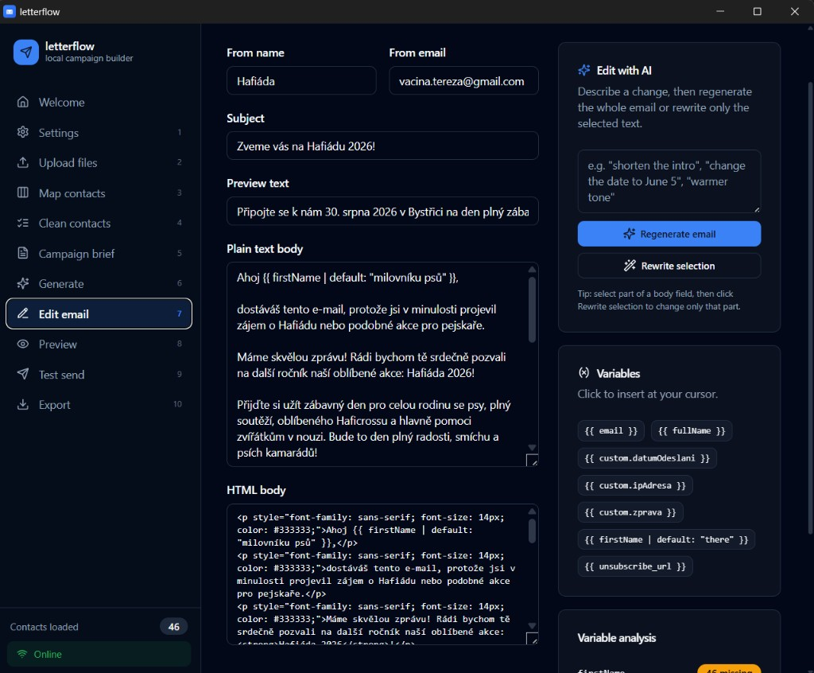
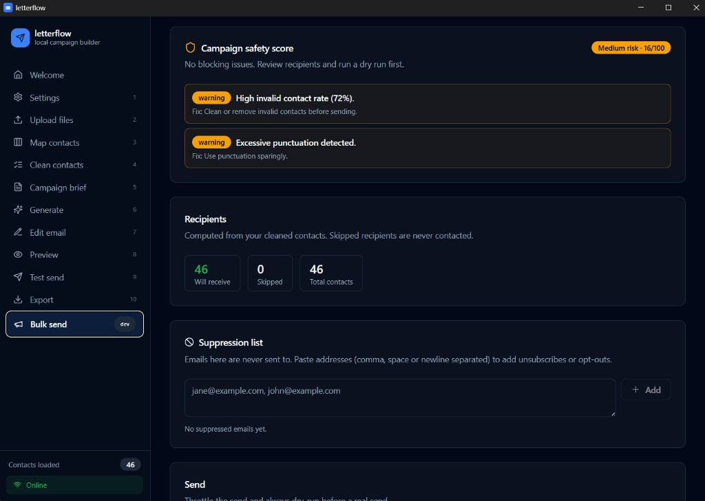
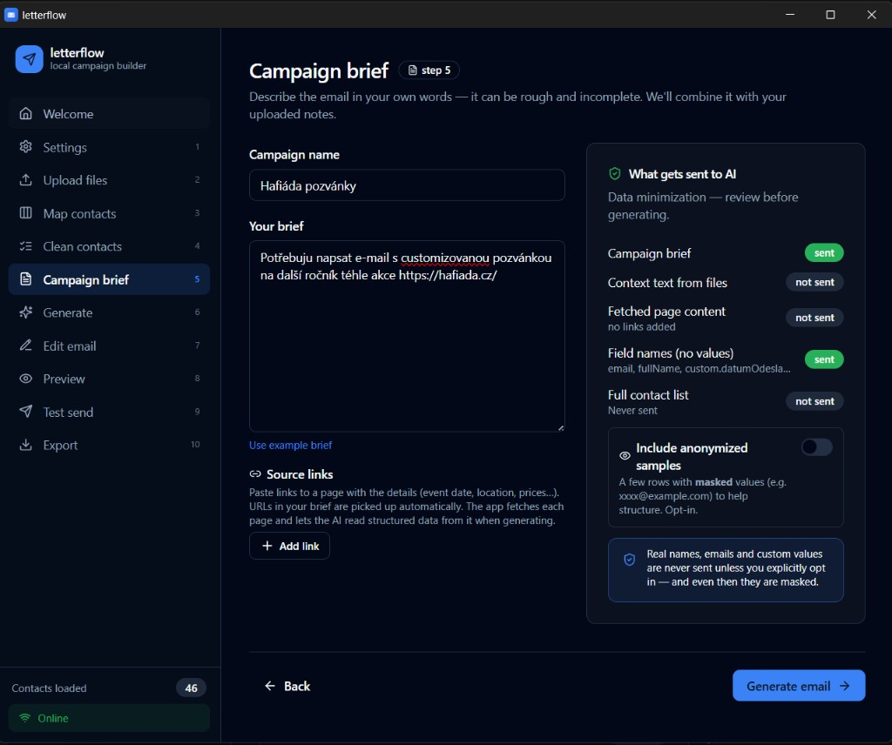
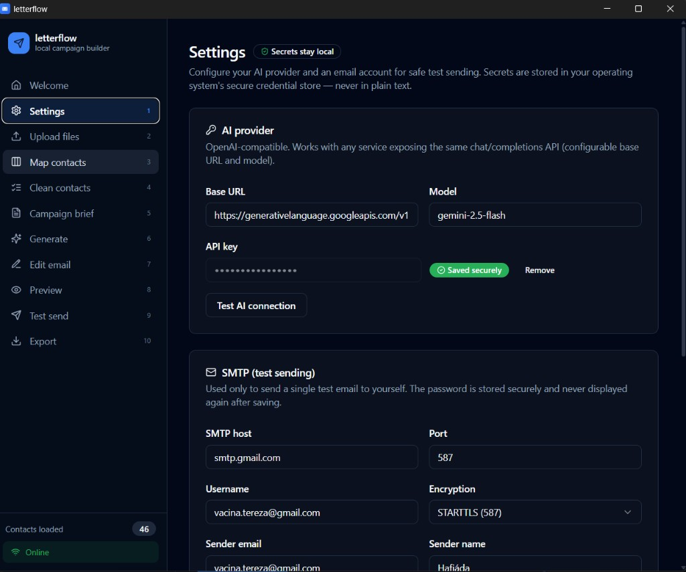

# letterflow

**Local, AI-assisted email campaign builder.** Turn messy files, spreadsheets and
notes into clean email drafts, validated contact lists, personalized previews,
and safe test sends — all on your own computer.

letterflow is a small, safety-first desktop alternative to tools like Ecomail,
Mailchimp, MailerLite or Brevo. It does **not** try to be a full newsletter
platform. Instead it focuses on the messy, error-prone preparation work:
importing and cleaning contacts, drafting a good email from a rough brief
(it can even read the facts straight from a web page), previewing
personalization, sending **one** safe test, and exporting everything so you can
send through a professional platform when you're ready.

> Built with Tauri + React + TypeScript. Your data stays local by default.



---

## Download (Windows)

The easiest way to try letterflow — **no developer tools required**:

1. Go to the [**latest release**](https://github.com/tereza-vac/letterflow/releases/latest).
2. Download `letterflow_<version>_x64-setup.exe` (NSIS installer) or the `.msi`.
3. Run the installer and launch **letterflow**.
4. Open **Settings** to add your AI key and SMTP details (see below), then follow
   the wizard.

> Windows 10/11. WebView2 is required and ships with Windows 11 (Windows 10 will
> install it automatically if missing). An internet connection is needed for AI
> generation and test sending.

Want to build it yourself or work on the code? See
[Build from source](#build-from-source).

---

## Quick start

Once installed (or running via `npm run tauri dev`), the left-hand stepper walks
you through 10 steps:

1. **Settings** — add an AI API key and SMTP account (both stored in your OS
   credential manager).
2. **Upload files** — drop in `.xlsx` / `.csv` (contacts) and `.md` / `.txt`
   (context notes).
3. **Map contacts** — confirm which columns map to email, name, custom fields.
4. **Clean contacts** — review validation, deduplication and the data-quality
   report.
5. **Campaign brief** — describe the email in plain words; optionally paste
   **source links** the AI should read facts from.
6. **Generate** — the AI drafts subject options, plain-text + HTML bodies, a
   footer and missing-info warnings.
7. **Edit email** — fine-tune manually, or use **Edit with AI** to regenerate
   from notes or rewrite a selected passage.
8. **Preview** — see the email rendered for diverse real contacts.
9. **Test send** — review the safety score, then send one confirmed test to
   yourself.
10. **Export** — download cleaned contacts, the email bodies and a full campaign
    archive for use in a professional sending platform.

> **Bulk send** is an optional advanced step. Turn it on in **Settings →
> Developer options** to reveal it in the sidebar. It is dry-run-first and
> guarded — see [Safety limitations](#safety-limitations).



A full walkthrough lives in [`docs/user-guide.md`](docs/user-guide.md).



---

## Features

- 📂 **Import** `.xlsx`, `.csv`, `.md`, `.txt` and auto-detect contact sources
  vs. campaign context.
- 🧭 **Map columns** to contact fields with confidence scores and plain-language
  explanations (recognizes English **and** Czech column names, plus custom
  fields like dog names).
- 🧹 **Clean contacts**: normalize and validate emails, deduplicate by email,
  carefully merge custom fields, and flag near-duplicate names for review —
  *without ever silently deleting data*.
- 📊 **Data quality report**: missing values, invalid email rate, duplicate
  rate, suspicious rows, long values, diacritics/special characters.
- 🌐 **Read facts from the web**: paste a link (or include a URL in your brief)
  and letterflow fetches the page, extracts structured data (`schema.org`
  JSON-LD) and metadata, and feeds verified facts (date, venue, …) to the AI so
  it doesn't have to guess.
- ✍️ **AI drafting** from a rough brief: 3 subject options, plain-text + HTML
  bodies, a footer with unsubscribe wording, and missing-information warnings.
  Structured JSON output, rendered part-by-part.
- 🪄 **Edit with AI**: regenerate the whole draft from short instructions, or
  select a passage and rewrite only that part — manual edits are always
  preserved.
- 🔠 **Template variables** (`{{ firstName }}`, `{{ custom.dogName }}`,
  `{{ unsubscribe_url }}`, with `| default: "there"` fallbacks) and
  missing-variable analysis.
- 👀 **Smart preview** across diverse real contacts (not just the first row),
  with unresolved variables and fallbacks highlighted.
- 🛡️ **Campaign safety score** with blocking checks (missing subject/sender/
  unsubscribe, unresolved variables, no SMTP, …).
- 📨 **One guarded test send** through your own SMTP, with a confirmation dialog
  and a full send log.
- 🚦 **Opt-in guarded bulk send** (off by default): a dry-run-first sender that
  throttles delivery, skips suppressed/unsubscribed/invalid and already-sent
  contacts, requires a successful test send and a clear safety score, and keeps
  a per-recipient log.
- 🧯 **Suppression list**: paste or import emails that must never be contacted;
  bulk send always skips them.
- 📤 **Export** cleaned/invalid/review contacts (CSV/XLSX), plain-text + HTML
  bodies, an import report, and a full JSON campaign archive.

### What it does **not** do yet

- ⚠️ Bulk sending is **opt-in and intentionally limited** — it is meant for small
  volumes from your own SMTP and is **not** a deliverability solution. It stays
  off until you enable it in **Settings → Developer options**.
- ❌ No real one-click unsubscribe page / hosting. The draft includes
  unsubscribe wording and an `{{ unsubscribe_url }}` placeholder; real
  unsubscribe handling belongs to a dedicated sending platform.
- ❌ No scheduling, A/B testing, analytics, or telemetry.

---

## Supported file types

| Type    | Treated as       | Parser           |
| ------- | ---------------- | ---------------- |
| `.xlsx` | contact source   | SheetJS (`xlsx`) |
| `.csv`  | contact source   | PapaParse        |
| `.md`   | campaign context | `marked`         |
| `.txt`  | campaign context | plain text       |

You can override the detected type for any file.

---

## Setting up the AI provider

letterflow works with any service that exposes the OpenAI-compatible
`/chat/completions` API. Configure it in **Settings → AI provider**.

**OpenAI (default)**

| Field    | Value                          |
| -------- | ------------------------------ |
| Base URL | `https://api.openai.com/v1`    |
| Model    | `gpt-4o-mini` (or any chat model) |

**Google Gemini** (OpenAI-compatible endpoint)

| Field    | Value                                                       |
| -------- | ----------------------------------------------------------- |
| Base URL | `https://generativelanguage.googleapis.com/v1beta/openai`   |
| Model    | `gemini-2.5-flash` (fast) or `gemini-2.5-pro`               |

Steps:

1. Paste your **API key** and click **Save key** (stored in the OS credential
   manager — never written to disk or logged).
2. Click **Test AI connection** to verify.



> Email generation uses a native HTTP path with a generous timeout in the
> desktop app. In the browser dev preview, AI calls are blocked by CORS — use the
> desktop app for real generation.

---

## Setting up SMTP test sending

1. In **Settings → SMTP**, enter host, port, username, sender email, sender
   name, and encryption mode (STARTTLS / SSL-TLS / none).
2. Click **Save password** (stored securely, never displayed again).
3. Click **Send connection test**.

SMTP sending only works in the packaged desktop app (the browser dev server
cannot open SMTP sockets).

---

## Build from source

For developers, or to produce your own installer.

### Prerequisites

- **Node.js** 18+ and **npm**
- **Rust** (stable) — required to build/run the desktop app. Install via
  [rustup.rs](https://rustup.rs).
- Platform build tools for Tauri — see the
  [Tauri prerequisites guide](https://v2.tauri.app/start/prerequisites/)
  (on Windows: *Microsoft C++ Build Tools* and *WebView2*, which ships with
  Windows 11).

### Clone & install

```bash
git clone https://github.com/tereza-vac/letterflow.git
cd letterflow
npm install
```

### Develop

```bash
# Full desktop app (requires Rust). SMTP, OS secure storage, web fetch and
# reliable AI calls all work here. This is the recommended way to run it.
npm run tauri dev

# Browser dev server (fast UI iteration only). No SMTP, no OS keychain, and AI
# calls + web fetch are blocked by browser CORS. Secrets live in memory only.
npm run dev
```

Other useful scripts:

```bash
npm run typecheck   # tsc --noEmit
npm run test        # vitest (unit tests for the core logic)
npm run build       # typecheck + Vite production build of the frontend
```

### Build a Windows installer

```bash
# One-time: generate app icons from the source SVG (or your own PNG)
npm run tauri icon src-tauri/icons/letterflow.svg

# Build the installers
npm run tauri build
```

Outputs (verified on Windows, MSVC toolchain):

- `src-tauri/target/release/letterflow.exe` (standalone)
- `src-tauri/target/release/bundle/nsis/letterflow_0.1.0_x64-setup.exe`
- `src-tauri/target/release/bundle/msi/letterflow_0.1.0_x64_en-US.msi`

macOS (`.dmg`) and Linux (`.deb`/AppImage) targets are configured for later.

A GitHub Actions workflow ([`.github/workflows/release.yml`](.github/workflows/release.yml))
builds and attaches the Windows installers automatically when you push a
`v*` tag (e.g. `git tag v0.1.0 && git push origin v0.1.0`).

---

## Privacy

- All contact data, files, and the local database stay on your device.
- **By default, no personal data is sent to the AI provider.** Only your brief,
  context text (including text fetched from links you provide), and anonymized
  **field names** are sent.
- Sample rows are sent **only** if you explicitly opt in, and even then values
  are **masked** (e.g. `xxxx@example.com`).
- Secrets are stored in the OS secure credential store (Windows Credential
  Manager / macOS Keychain / Linux Secret Service), never in the database.
- No telemetry.

See [`docs/security.md`](docs/security.md) for the full security model.

## Safety limitations

- letterflow prepares and tests campaigns; it is **not** a deliverability
  solution. Real bulk sending requires SPF/DKIM/DMARC, proper unsubscribe
  handling, and reputation management.
- The `{{ unsubscribe_url }}` placeholder is **not** a working unsubscribe link;
  it is filled with a `mailto:` fallback for previews/tests and should be
  replaced by a real link in your sending platform.
- Bulk sending is **off by default**. When enabled in **Settings → Developer
  options** it stays guarded: it defaults to a **dry run**, requires a completed
  test send and a clear safety score, throttles delivery with a configurable
  delay, and always skips suppressed/unsubscribed/invalid and already-sent
  contacts. It is intended for small volumes only.

> ⚠️ For real campaigns, export your cleaned contacts and content and send
> through a dedicated email platform with proper deliverability and unsubscribe
> handling (Ecomail, Mailchimp, MailerLite, Brevo, Amazon SES, …).

---

## Documentation

| Document | What's inside |
| -------- | ------------- |
| [`docs/user-guide.md`](docs/user-guide.md) | Step-by-step walkthrough of the whole wizard |
| [`docs/architecture.md`](docs/architecture.md) | Tech stack, data flow, AI & web-fetch pipeline |
| [`docs/security.md`](docs/security.md) | Full security & privacy model |
| [`docs/product-spec.md`](docs/product-spec.md) | Product positioning and screen-by-screen spec |
| [`docs/roadmap.md`](docs/roadmap.md) | Milestones and what's next |
| [`CHANGELOG.md`](CHANGELOG.md) | Release notes |

## Project structure

```
letterflow/
├─ src/
│  ├─ app/            # App shell, global state (zustand), styles
│  ├─ components/     # UI primitives (shadcn-style) + layout
│  ├─ features/       # One folder per step screen
│  └─ lib/            # Pure, tested business logic
│     ├─ ai/          # provider abstraction, OpenAI/Gemini, prompt, web fetch, secure store
│     ├─ contacts/    # normalize, validate, dedupe, fuzzy, quality-report
│     ├─ imports/     # parse-csv/xlsx/markdown, detect-columns
│     ├─ templates/   # render + validate template variables
│     ├─ safety/      # campaign-risk scoring
│     ├─ preview/     # smart preview sampling
│     ├─ email/       # provider abstraction + SMTP bridge
│     ├─ export/      # CSV/XLSX/JSON exporters
│     └─ storage/     # SQLite schema + persistence adapter
├─ src-tauri/         # Rust backend (SMTP via lettre, OS keyring, AI HTTP), config
└─ docs/              # product spec, security, architecture, roadmap, user guide
```

## License

[MIT](LICENSE)
