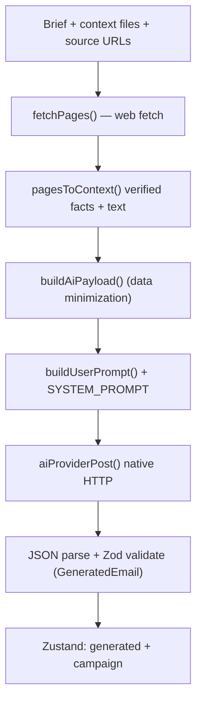

# Architecture

A technical overview of how letterflow is put together: the stack, where state
lives, and the two network flows (AI generation and web fetching).

## Stack

| Layer | Technology |
| ----- | ---------- |
| UI | React 19 + TypeScript, Tailwind CSS, shadcn-style primitives (Radix UI) |
| State | Zustand store (`src/app/store.ts`), persisted to disk |
| Desktop shell | Tauri 2 (Rust) — window, native HTTP, SMTP, OS keyring, SQLite |
| Build | Vite 6, `tsc` for type-checking, Vitest for unit tests |
| Backend (Rust) | `lettre` (SMTP), `keyring` (secrets), `reqwest` (AI HTTP), `tauri-plugin-sql` (SQLite) |

The same frontend runs in two environments:

- the **Tauri webview** (production desktop app), where native APIs exist; and
- a **plain browser** (Vite dev server / tests), where they don't.

Code paths that need native capabilities check `isTauri()`
(`src/lib/runtime.ts`) and fall back to safe browser behavior.

## Directory layout

```
src/
  app/         App shell, Zustand store, global styles
  components/  UI primitives + layout (stepper, shells)
  features/    One folder per wizard step (welcome, upload, campaign, …)
  lib/         Framework-free, unit-tested business logic
    ai/        provider abstraction, OpenAI/Gemini, prompts, web fetch, secure store, http
    contacts/  normalize, validate, dedupe, fuzzy match, quality report
    imports/   CSV/XLSX/Markdown parsing, column detection
    templates/ parse, render and validate {{ variables }}
    safety/    campaign risk scoring
    preview/   smart sampling of contacts for preview
    email/     provider abstraction + SMTP bridge to Rust
    export/    CSV/XLSX/JSON exporters
    storage/   SQLite schema + persistence adapter
src-tauri/     Rust backend + Tauri config/capabilities
docs/          spec, security, architecture, roadmap, user guide
```

## State & persistence

All shared state lives in a single Zustand store (`src/app/store.ts`):
settings, uploaded files, mappings, contacts, the current `campaign`, the last
AI `generated` draft, `sourceUrls`, and test-send logs.

- The non-secret slice is **debounced and persisted** through a storage adapter
  (`src/lib/storage/persist.ts`): SQLite via `tauri-plugin-sql` in the desktop
  app, `localStorage` in the browser.
- **Secrets are never persisted here.** API keys and SMTP passwords go to the OS
  credential store (see [Secrets](#secrets)).
- On startup, `hydrate()` loads the persisted slice and then re-syncs the
  "secret saved" flags against the real secure store, so the UI can't show a
  stale "Saved securely" badge after secrets were cleared (e.g. a browser
  reload).

## Wizard flow

```
Welcome → Settings → Upload → Map → Clean → Brief → Generate → Edit → Preview → Test send → Export
```

The `generated` draft is stored in Zustand and the recommended subject is
written into the `campaign` immediately after generation, so the Edit/Preview/
Test steps always have content regardless of how the user navigates.

## AI generation pipeline



Key modules:

- `src/lib/ai/generate-email.ts` — `buildAiPayload()` assembles a **minimized**
  payload (brief, context text, anonymized field names; masked sample rows only
  on opt-in). Also exposes `refineEmail()` and `rewriteSelection()` for the
  Edit-with-AI features.
- `src/lib/ai/prompt.ts` — system prompts and prompt builders. The system prompt
  forbids inventing facts and treats a **"Verified facts"** block as
  authoritative.
- `src/lib/ai/providers/openai.ts` — the OpenAI-compatible provider implementing
  `generateEmail` / `refineEmail` / `rewriteSelection` / `testConnection`.
  Generation uses a lower temperature (0.3) to reduce hallucination.
- `src/lib/ai/types.ts` — Zod schemas (`GeneratedEmail`, `EmailDraft`) used to
  validate model output before it touches the UI.

### Provider abstraction

`AiProvider` (`src/lib/ai/types.ts`) is an interface, registered in a small map
in `generate-email.ts`. Adding Azure OpenAI, Anthropic, or a local model means
implementing the interface and registering it — the UI and pipeline stay the
same.

## Web fetch & fact extraction

`src/lib/ai/fetch-url.ts` turns links into structured context:

1. `collectSourceUrls()` merges explicit source links with URLs found in the
   brief text.
2. `fetchPageText()` downloads the page via `providerFetch` (native HTTP in the
   desktop app, so no CORS).
3. Extraction order, designed for JavaScript-rendered SPAs:
   - **JSON-LD** `schema.org/Event` → `formatEventFacts()` produces exact event
     name, start/end, venue and address;
   - **head metadata** (`<title>`, `meta description`, Open Graph);
   - **main text** via Mozilla Readability, with a plain tag-strip fallback.
4. `pagesToContext()` labels the JSON-LD output as **Verified facts
   (authoritative)** so the prompt can prioritize it.

The unit tests in `src/lib/ai/fetch-url.test.ts` cover the fact formatter and
URL collection.

## Networking

Two outbound paths, both initiated only by explicit user actions:

- **AI calls** — `aiProviderPost()` (`src/lib/ai/http.ts`). In the desktop app
  this invokes the Rust command `ai_http_post` (`src-tauri/src/ai_http.rs`),
  which uses `reqwest` with a **120s timeout** (full generation can exceed the
  ~30s default of the generic HTTP client) and returns friendly timeout/connect
  errors. For Gemini endpoints, `response_format: json_object` is omitted (the
  JSON shape is enforced via the prompt) to avoid compatibility issues.
- **Web page fetch** — `providerFetch()` via the Tauri HTTP plugin, scoped to
  `https://*` in `src-tauri/capabilities/default.json`.

The webview Content-Security-Policy (`src-tauri/tauri.conf.json`) allows
`connect-src https:` plus the Tauri IPC channel.

## Sending

SMTP send happens entirely in Rust (`src-tauri/src/smtp.rs`) using `lettre` with
rustls TLS, behind the `smtp_test` / `smtp_send` commands. Browsers can't open
SMTP sockets, so sending is unavailable (and clearly reported) in the dev
server. Test send dispatches **one** confirmed email at a time and logs it.

**Guarded bulk send** (opt-in, `src/features/bulk-send/`) is a thin, controlled
loop over the same `smtp_send` path — no extra backend. Recipient selection is a
pure, unit-tested function (`src/lib/email/bulk-send.ts`) that excludes
suppressed/unsubscribed/invalid and already-sent contacts before any send. It is
dry-run-first, throttled by a per-email delay, blocked unless a test send
succeeded and the safety score is clear, and writes a per-recipient log to the
store so re-runs skip prior successes.

## Secrets

`src/lib/ai/secure-store.ts` defines a `SecureStore` interface with two
implementations:

- **Desktop:** `TauriKeyringStore` → Rust `secure_get/secure_set/secure_delete`
  commands (`src-tauri/src/secure.rs`) backed by the `keyring` crate (Windows
  Credential Manager / macOS Keychain / Linux Secret Service).
- **Browser dev:** `MemorySecureStore` — in-memory for the session only, cleared
  on reload.

Secrets are never written to the database, never logged, and never re-displayed
after saving. See [`security.md`](security.md) for the complete model.

## Templates

`src/lib/templates/render-template.ts` parses `{{ path | default: "…" }}`
tokens, resolves them against a contact (plus system variables like
`unsubscribe_url`), and reports unresolved/fallback usage.
`validate-template.ts` powers the missing-variable analysis and feeds the safety
score. System variables (e.g. `unsubscribe_url`) are always treated as
resolvable and are injected at send/export time.

## Testing

Pure logic in `src/lib/**` is covered by Vitest
(`npm run test`): imports/parsing, contact cleaning, templates, safety scoring,
and web-fact extraction. UI screens are thin wrappers over this logic and are
exercised manually via the desktop dev app.
